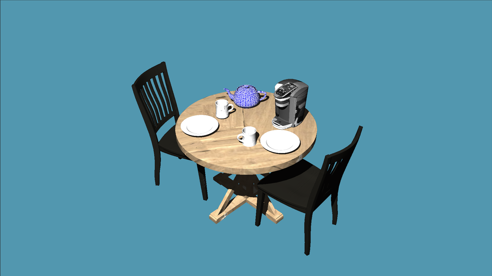
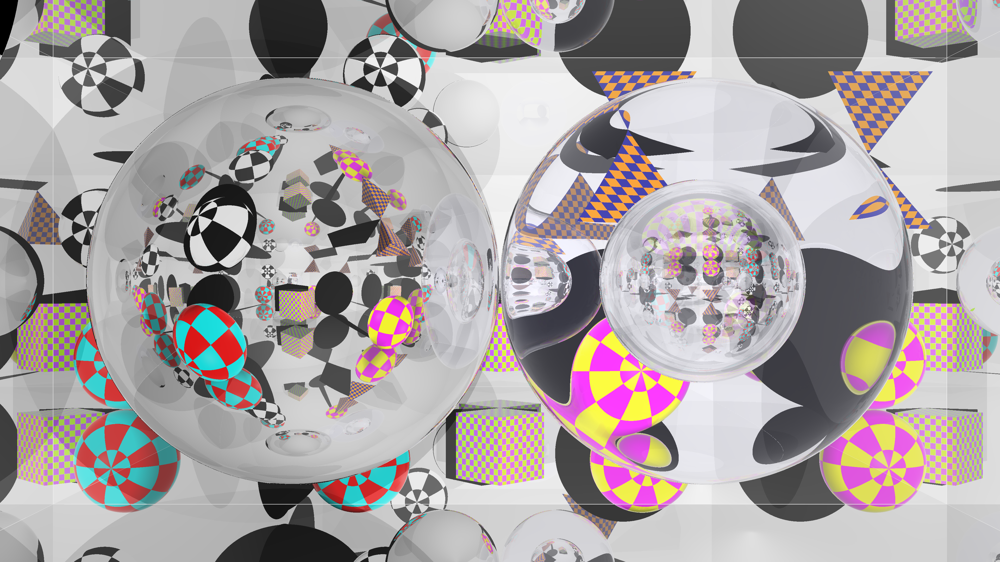
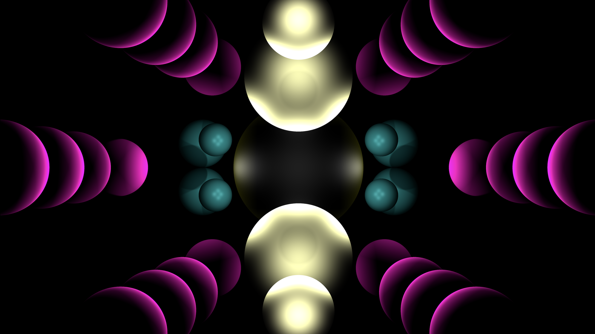

# Raytracer
A raytracer written in C.

# Showcase




## Features
- Sphere, ellipsoid, and triangle equations
- Parallel and perspective projections
- Lighting and illumination
- Hard and soft shadows
- Depth cueing
- Light source attenuation
- Smooth shading with vertex normals
- Flat shading with plane normals
- Color based textures
- Surface normal texture mapping
- Specular reflections
- Transparency and refraction
- Visibility attenuation through transparent materials
- Bounding volume hierarchies

# Building
`$ make`

# Testing
`$ ./raytracer.sh` will generate test images to look at in the `tests/` directory

# Usage
`$ ./raytracer [-s:soft shadows] <path/to/input_file>`

## Input File Format
Sample input files are provided in the `tests/` directory this repo.

### Header
This section defines the scene's general viewing parameters. The individual values can appear in any order, but this section must be at the top.
```
imsize w h
eye x y z
viewdir x y z
hfov v
vfov v
updir x y z
bkgcolor x y z η
parallel v
light x y z w i
attlight x y z w i c1 c2 c3
depthcueing dcr dcg dcb αmin αmax distmin distmax
```
### Body
This section defines the objects within the scene and their colors. `mtlcolor` must come first followed by the objects that are that color in any order. This section must come last.
```
bvhsphere x y z r

mtlcolor Dr Dg Db Sr Sg Sb ka kd ks n α η μ
sphere x y z r
ellipse x y z rx ry rz

mtlcolor Dr Dg Db Sr Sg Sb ka kd ks n α η μ
sphere x y z r
ellipse x y z rx ry rz

mtlcolor Dr Dg Db Sr Sg Sb ka kd ks n α η μ
v x y z
v x y z
v x y z
...

vt x y
vt x y
vt x y
...

vn x y z
vn x y z
vn x y z
...

texture path/to/texturemap.ppm
bump path/to/normalmap.ppm

f v1/vt1/vn1 v2/vt2/vn2 v3/vt3/vn3
f v1/vt1/vn1 v2/vt2/vn2 v3/vt3/vn3
f v1/vt1/vn1 v2/vt2/vn2 v3/vt3/vn3
...
```

## Notes:
- The program accepts values for both hfov and vfov. If both are provided then hfov will be used.
- The `-s` flag is optional. If included, the scene will render using soft shadows instead of hard shadows. _This will take a lot longer._
- Faces can be given as `f v1 v2 v3` `f v1/vt1 v2/vt2 v3/vt3` or `f v1/vt1/vn1 v2/vt2/vn2 v3/vt3/vn3`.
- Input files must be `.txt` files.
- The RGB scale is from 0-1.
- Field of view accepts the value v in degrees, not radians.
- Parallel is an optional parameter that accepts frustum width as its value v.
- Lights are optional, if none are specified then the scene will render without lighting.
- All entries in the header, including lights, _must come before_ entries in the body.
- The attenuation coefficient μ on a mtlcolor is optional.
